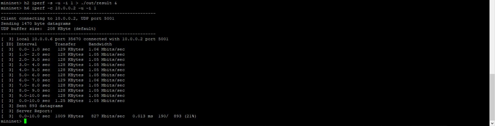
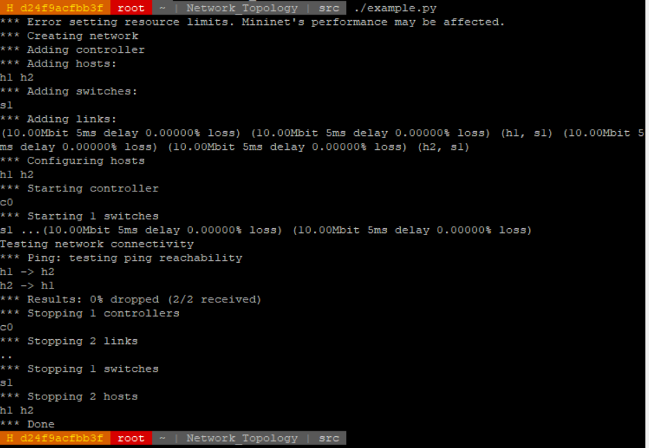

# Network Topology with Mininet

This repository is lab for NCTU course "Introduction to Computer Networks 2018".

---
## Abstract

In this lab, we are going to write a Python program which can generate a network topology using Mininet and use iPerf to measure the bandwidth of the topology.

---
## Objectives

1. Learn how to create a network topology with Mininet
2. Learn how to measure the bandwidth in your network topology with iPerf

---
## Execution

To execute the program, run 

```
Network_Topology/src/topology.py
```
This will create and start the network.  
After pinging all the hosts, mininet enters CLI mode.  
We can then execute the iPerf command.  
The result is shown in the following picture.  


---
## Description

### Mininet API in Python

```python
from mininet.topo import Topo
from mininet.net import Mininet
from mininet.util import dumpNodeConnections
from mininet.log import setLogLevel
from mininet.cli import CLI
from mininet.link import TCLink
```
Importing the required libraries from the Mininet API.
```python
setLogLevel('info')
```
Set Mininet's default output level. We use info since it provides useful information
```python
class Topo0 (Topo):
    def build(self):
    ...
```
Topo 0 inherits from Mininet's Topo class, and override the build() function to define our own build function.
```python
self.addHost('h%s'%(i+1))
```
Create a host in the topology, using the string in the brackets as the name.  
'h%s'%(i+1) is Python's string formating, substituting %s with i+1
```python
self.addSwitch('s%s'%(i+1))
```
Create a switch in the topology, using the string in the brackets as the name.  
's%s'%(i+1) is python's string formating, substituting %s with i+1
```python
self.addLink( host[0], switch[0], bw=10, delay = '50us', loss = 12)
```
Create a bidirectional link in the topology.  
The first two parameters are the two nodes we want to link together.  
The bw parameter is an integer that represents the bandwidth in Mbps.  
The delay paramter is a string that represents the delay with units.
The loss paramter is an integer that represents the loss percentage.
```python
Mininet(topo=topo,link = TCLink)
```
Create a Mininet network emulation object, using the topology defined in object "topo".  
The link type is set to TCLink to allow the limitations set in addLink().
```python
net.start()
```
Start the "net" network emulation.
```python
dumpNodeConnections(net.hosts)
dumpNodeConnections(net.switches)
```
Dump the connections from the nodes specified in the brackets.
```python
net.pingAll()
```
Test connectivity by having all the nodes ping each other.
```python
CLI(net)
```
Invoke Mininet's CLI(command line interface) mode, with the network emulation being "net".

### iPerf Commands

```shell-script
h2 iperf -s -u -i 1 > ./out/result &
```
Run iPerf on h2 with arguments -s -u -i 1, then write the output to file /Network_Topology/out/result instead of stdout(the terminal)( > ./out/result ).  
The & at the end means that iperf will run in the background.  
iperf -s -u -i 1 means that we run iPerf in server mode( -s ), the connection type is UDP( -u ), and a report about the bandwidth, jitter, and loss is made every second( -i 1 ).  
```shell-script
h6 iperf -c 10.0.0.2 -u –i 1  
```
Run iPerf on h6 with arguments -c 10.0.0.2 -u -i 1.  
This one isn't executed in the background, and the output we see in the terminal is this part.  
iperf -c 10.0.0.2 -u -i 1 means that we run iPerf as a client and connect to 10.0.0.2( -c 10.0.0.2 ), using UDP ( -u ), and a report about the bandwidth, jitter, and loss is made every second( -i 1 ).  


### Tasks

> TODO:
> * Describe how you finish this work step-by-step in detail

1. **Environment Setup**
    1. Set up GitHub repository
        * Join the GitHub classroom, and a repository is created for us.  
        * Mine is at https://github.com/nctucn/lab2-baili0411  
        * We can then clone the project from this repository, and push to this repository.
    2. Login to the container using SSH
        * There is a container set up for us, with Mininet and iPerf installed.  
        * Connect using PieTTY using the IP and port number given in the slide. (IP: 140.1131.95.69, Port:61620) 
        * Login to root. (I didn't change the password of the root account, still using default)
    3. Clone the GitHub repository
        ```
        git clone https://github.com/nctucn/lab2-baili0411.git
        ```
        * Network_Topology clones the repository in to a folder called Network_Topology  
        ```
        git config --global user.name "Baili Deng"  
        git config --global user.email rayman0411@gmail.com
        ```  
        * Since this is the first time we use this container for git, also set up config for name and email.  
        * Proper Git usage means that I should also create a branch to work on, then merge back to master, but I forgot.
    4. Run Mininet for testing
        ```
        mn
        ``` 
        * Error message
        ```  
        service openvswitch-switch start  
        mn
        ```  
        * Mininet works.  


2. **Example of Mininet**
    1. Run example code
        * Change directory first.
        ```
        cd Network_Topology/src
        ```
        * Run example.py.
        ```
        ./example.py
        ```
        * Doesn't work!  
        Let's check permissions.
        ```
        ls -l
        ```
        * No execute permission for example.py, activate it, then try again.
        ```
        chmod +x example.py
        ./example.py
        ```
        * Works this time  
        


3. **Topology Generator**
    1. View the toplogy you should generate
        * 0616020 % 3 is 0
        * I should use topo0.png  
        
    2. Generate the topology via Mininet
        * Create topology.py based mainly on the example in https://github.com/mininet/mininet/wiki/Introduction-to-Mininet, also some from example.py
        * Add a shebang to enable executing topology.py without calling python.  
        ```Python
        #!/usr/bin/python
        ```
        * Change the used topology class.
            * There isn't a good way to implement the topology using loops, mainly since the parameters(bandwidth, delay, loss) for each link is irregular.
            * Add each host and switch using a loop, and save them in arrays.
            * Add each link manually.
            ```Python
            class Topo0 (Topo):
                def build(self):
                    switch = []
                    host = []
                    #Create hosts h1~h6
                    for i in range(6):
                        host.append(self.addHost('h%s'%(i+1)))
                    #Create switches s1~s9
                    for i in range(9):
                        switch.append(self.addSwitch('s%s'%(i+1)))
                    #Since all the links have different statistics, generate them manually
                    #Python arrays start from 0, the index in array is one smaller than actual index
                    #Example: host[0] is h1
                    self.addLink( host[0], switch[0], bw=10, delay = '50us', loss = 12)	
                    self.addLink( host[1], switch[1], bw=5, delay = '2ms', loss = 3)	
                    self.addLink( host[2], switch[2], bw=7, delay = '63us', loss = 9)	
                    self.addLink( host[3], switch[3], bw=12, delay = '40us', loss = 14)	
                    self.addLink( host[4], switch[4], bw=15, delay = '30us', loss = 18)	
                    self.addLink( host[5], switch[5], bw=3, delay = '5ms', loss = 2)	
                    self.addLink( switch[0], switch[6], bw=23, delay = '1ms', loss = 8)	
                    self.addLink( switch[1], switch[6], bw=18, delay = '2ms', loss = 9)	
                    self.addLink( switch[2], switch[6], bw=15, delay = '3ms', loss = 5)	
                    self.addLink( switch[3], switch[7], bw=19, delay = '80us', loss = 7)	
                    self.addLink( switch[4], switch[7], bw=30, delay = '95us', loss = 2)	
                    self.addLink( switch[5], switch[7], bw=20, delay = '60us', loss = 6)	
                    self.addLink( switch[6], switch[8], bw=40, delay = '5ms', loss = 2)	
                    self.addLink( switch[7], switch[8], bw=50, delay = '4ms', loss = 3)	
            ```
        * When starting Mininet, we need the parameter (link = TCLink), or else we can't use the parameters we set for the link.(There will be errors)
        ```Python
        net = Mininet(topo=topo,link = TCLink)
        ```
        * Dump the connections of both the hosts and switches as required.
        ```Python
        print "Dumping host connections"
        dumpNodeConnections(net.hosts)
        print "Dumping switch connections"
        dumpNodeConnections(net.switches)
        ```
        * Enter CLI mode, need to import the required module first.
        ```Python
        from mininet.cli import CLI

        ...

        CLI(net)
        ```
        * If we just ignore net.stop() like in the slide, there will be errors if we try to execute the code again.  
        We solve this by adding net.stop() after CLI(net), which will stop the hosts, switches, links and controller after we exit CLI mode.

4. **Measurement**
    * Execute iPerf commands from certain hosts to test the network topology.
    * For topo0.png, I have to execute:
    ```shell-script
    h2 iperf -s -u -i 1 > ./out/result &
    h6 iperf -c 10.0.0.2 -u –i 1  
    ```
    * The details of the iperf commands are written above.
    * The output of h2's iperf command is dumped in Network_Topology/out/result
    * The output of h6's iperf command is shown in  the terminal:  
    
    * The packet loss rate (21%) is in the approximate value (21%~26%) shown in the slide.

---
## References


* **Mininet**
    * [Mininet Walkthrough](http://mininet.org/walkthrough/)
    * [Introduction to Mininet](https://github.com/mininet/mininet/wiki/Introduction-to-Mininet)
    * [Mininet Python API Reference Manual](http://mininet.org/api/annotated.html)
* **Others**
    * [iPerf3 User Documentation](https://iperf.fr/iperf-doc.php#3doc)
    * [Cheat Sheet of Markdown Syntax](https://www.markdownguide.org/cheat-sheet)
    * [Line Breaks in Markdown](https://gist.github.com/shaunlebron/746476e6e7a4d698b373)

---
## Contributors

* [Baili Deng](https://github.com/baili0411)
* [David Lu](https://github.com/yungshenglu)

---
## License

GNU GENERAL PUBLIC LICENSE Version 3